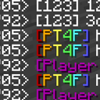

<div style="text-align: center; margin: 20px">
    
    <p style="font-size: 30px; font-weight: bold;">Player Title for Fabric</p>
    <p style="font-size: 20px;">A player title Minecraft mod for Fabric.</p>
</div>

[](https://github.com/OakPlatinum/playertitleforfabric/actions)
[](https://github.com/OakPlatinum/playertitleforfabric/releases/latest)
[](https://modrinth.com/mod/pt4f)
[](https://github.com/OakPlatinum/playertitleforfabric)

## Via Config
The config file is `pt4f.json`, powered by [**Midnight Lib**](https://modrinth.com/mod/midnightlib).

All operations can be done via config, an example is shown below:

```json
{
  "runningMode": "api",
  "rootCommandAlias": "pt4f",
  "defaultTitle": "",
  "prefix": "",
  "suffix": " ",
  "playerTitleData": [
    "3db42575-2d30-381e-b767-ea78178345ae,[Some Text Here]",
    "de6c7baa-0bd3-34f4-81e0-2a85bbae7554,\u00265[Player Title]\u0026r"
  ]
}
```

- runningMode: "api" or "mixin"(WIP)
- rootCommandAlias: an alias of the root command(WIP)
- defaultTitle, prefix, suffix
- playerTitleData:
  Every item is a title data, following the format below:
  UUIDOrPlayerName,(seperated with a comma)TitleText

**Don't forget to reload the config by using "/playertitle reload"**

## Via Commands
Also some can be done via commands, for now there's mainly 2 commands:
- `/playertitle grant <PlayerSelector> <title>`  // will record player uuid
- `/playertitle grant -o <OfflinePlayerName> <title>`  // will record player name
- `/playertitle revoke <PlayerSelector>`  // will record player uuid
- `/playertitle revoke -o <OfflinePlayerName>`  // will record player name

**Note:**
1. If more than one player is provided, overwrite mode will automatically turn off, which means you can't replace title of players that already have one, while it's on when one or an offline player name is provided.
2. UUIDs have higher priority than player names.
3. If using format code in commands, you need to use `&` instead of `§`，and `&&` to represent `&`.

